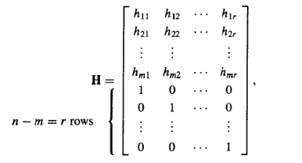

# group and coding

1. 信息单元：
    * 消息(message):多个0，1串组成的有限字符串
    * 字(word):一个0，1字符串

2. 群：定义在(B,+); $B^m$  = B×B×B×B×...×B。(其中+为或操作，即为mod 2)

3. 噪声(noise): $B^m$ 在通过传输过程中因为噪声从而在某些为上产生差错

4. 编码函数(encoding function): 整数n>m,定义单射函数e: $B^m$ -> $B^n$ ，称为(m,n)编码函数：

    * 码字(code word):若b∈ $B^m$ ，则e(b)称为表示b的码字
    * 非码字：码字以外的信息；e中有 $2^n$ - $2^m$ 个非码字

5. 差错检验：

    * 码重(weight):对于b∈$B^m$，x = e(b) 中1的个数称为x的权，用|x|表示
    * 奇偶校验码(parity check code): 在码字末尾加一位校验码，若权为偶数，则为0，否则为1(偶校验);只能检测出奇数个的位的错误

6. 海明距离(Hamming distance): x,y为 $B^m$ 中的字，x，y之间的海明距离为 $\delta$ (x,y) = |x $\bigoplus$ y|,即为x，y之间不同位的个数

    1. 距离函数的性质：

        * $\delta$ (x,y) =  $\delta$ (y,x)
        * 非负性
        * $\delta$ (x,y) = 0 $\equiv$ x = y
        * $\delta$ (x,y) <= $\delta$ (x,z) + $\delta$ (z,y)

    2. 最小距离(minimun distance): 定义在编码函数e：$B^m$ -> $B^n$ 中。所有码字的距离的最小值，即min{ $\delta$(e(x),e(y)) | x,y∈$B^m$},与纠错能力正相关

    3. (m,n)编码函数e：$B^m$ -> $B^n$ 能检测出k个即以下的错误 $\equiv$ 编码函数的最小距离至少为k+1

7. 群码(group code): (m,n)编码函数e：$B^m$ -> $B^n$ ，若e( $B^m$ ) = {e(b) | e(b)∈ $B^n$ } 为 $B^n$ 的子群，则称该编码函数为群码
   1. 设(m,n)编码函数e为群码，则e的最小距离为非零码字的权值的最小值（该码字与零码字做海明距离）

## 构建群码

1. 运算：

    * 异或（模二加）：$\bigoplus$ ，1+1=0,1+0=1,0+0=0
    * 模二布尔乘：*,1*1=1,1*0=0
    * 定理：矩阵 $D^{m×p},E^{m×p},F^{p×n}$ , 则有(D $\bigoplus$ E)*F = (D\*F) $\bigoplus$ (E*F)

2. 一致性检验矩阵(parity check matrix):

    * x= $x_1x_2...x_n$ ∈ $B^n$ 表示1×n的矩阵
    * 定理：非负整数m < n,r = n-m, H为n×r的布尔矩阵，则函数 $F_H$ (x) = x*H 为从 $B^n$ 到 B$^r$ 的同态映射
    * 推论：B$^n$ 的正规子群为 N = {x∈ B$^n$ | x*H = 0}
    * 一致性检验矩阵：

          

        使用H定义编码函数：编码函数 e$_H$ ：$B^m$ -> $B^n$.  
        其中：b = $b_1b_2...b_m$  
        x = $e_H$ (b) = $b_1b_2...b_mx_1x_2...x_r$  
          

3.使用一致性检验矩阵构建群码

1. 确定m = n-r, 即 $B^m$ = {000..00,000..01,...}
2. 求出 $B^n$ , x = $e_H$ (b) = $b_1b_2b_m$$x_1x_2...x_r$,即求出$x_1x_2...x_r$
3. 求出 $x_i$ 。$x_i$ = $b_1*h_{1i} + b_2*h_{2i} +...+ b_r*h_{1r}$
4. 注意这里作的是 +(模二加)(1+1=0)，*(模二乘)

---

## Decoding and Error Correction

1. Decoding Function 译码函数

    * e：$B^m$ -> $B^n$是(m,n)编码函数，则满射函数d:$B^n$ -> $B^m$ 称为与e关联的译码函数。即(doe)(b) = d(e(b)) = b

    * 对(e,d)被称为纠k位或更少位错

2. Maximum likelihood technique 极大似然技术:以编码函数e得到相应的解码函数d

    $B^m$ 有 $2^m$ 个元素，并且在 $B^n$ 中有 $2^m$ 个码字。将这些码字以 $x^{(1)},x^{(2)},...,x^{(2^m)}$ 排列  
    接收的到的字为 $x_t$,从  
      
    选择第一个码字，称之为 $x^{(s)}$,即其为最接近 $x_t$ 且在列表的第一个  

    如果$x^{(s)}$ = e(b), 则定义极大似然阶码函数d 通过d($x^{(t)}$) = b 与e相关联

3. 定理：(e,d) 可以纠错最多k位， iff  e的最小距离至少位 2k+1

4. 定理：如果K是群G的有限子群，那么G中K的每一个左配集都有和K一样多的元素

5. 群码字：(m,n)编码函数e：$B^m$ -> $B^n$ 是群码，在 $B^n$ 中码字的集合N是 $B^n$ 的子群：
    

6. Coset leader 陪集头

    1. 假设 x = e(b)被传送，码字$x_t$被接受
    2. 左陪集：
    3. 配集中的一个元素 $\varepsilon_j$，拥有最小权值，被叫做陪集头

7. 给定群码 e：$B^m$ -> $B^n$，构建极大似然阶码函数d

    1. 确定所有在 $B^n$ 中的左陪集 N = e($B^m$)。
    2. 对于每一个陪集，找到最小码重的码字，即陪集头。
    3. 接收的码字 $x_t$, 确定 $x_t$ 属于的陪集
    4. $\varepsilon_j$是该陪集的陪集头。计算 x = $x_t\bigoplus\varepsilon$。如果x = e(b),使d($x_t$) = b.即解码 $x_t$为 b

8. 例

      

    * 将群码列出(最小码重的放在最前面)
    * 每一个陪集的陪集头即为距离第一行群码的第一个元素为距离为(1,2,3..)(从1开始，都找完了在从2，3..)的元素，且该元素在之前几行没有出现过
    * 陪集剩下的项是由陪集头与第一行群码的对应列的元素异或得到的。
    * 收到的码字为 $x_t$，在到其所在行的陪集头，然后计算 x = $x_t\bigoplus\varepsilon$, 在将其解码d($x_t$) = b，这个b就是 $B^m$ 中的了

9. Syndrome 特征值：子码表中的每一行中的元素是互相等价的，即每一行都是一个等价类，这些等价类有一个特征值

    接收码字x, 则 x*H 记为x的特征值

    注：$B^m$ 中有 $2^m$ 个项，即这些项应一一对应着一些值，所以有 $2^m$ 个等价类，$2^m$ 个特征值