# Semigroup and group

## Binary Operations Revisited 二元运算

1. Methematical structure（数学结构）一个对象的集合，在其上定义了操作和相应的属性，形成了一个数学结构或系统。如：[sets,+,-]
2. closure 封闭。操作的结果还在该集合中。例如：a,b∈Z,a$^b$不封闭，因为2$^-1$ = 1/2不在整数集中
3. Binary operation （二元运算）a+b(一个操作两个对象)。unary operation （一元运算）-a(一个操作一个对象)
4. commutative 交换律。x □ y = y □  x，则□ 是可交换的
5. associative 结合律。(x□ y)□ z = x□ (y□ z)
6. distributive property 分配律。x□(y\*z) = (x□y)\*(x□z).格也是操作
7. 德摩根：(x□y)\*=x\*#y\*且(x#y)\* = x\*□y\*
8. idempotent（等幂律）.a\*a = a
9. identity 单位元。x□e = e□x = x ，x for all
10. inverse 逆元：x□y=y□x=e,则称y/x是x/y的逆元
11. 运算表(table).定义二元操作在一个有限集合上得到的表

    \* 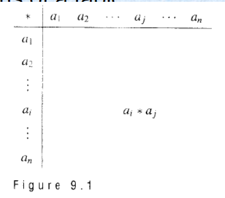
    \* 如果A = {a,b},则可以有16种可定义的操作（每一格是0或1）

## Semigruops

定义：

1. 代数系统< S,\*>,若S非空且\*是$\color{red}{封闭的}$，则称< S,\*>为广群
2. 代数系统< S,\*>,若S非空且\*是$\color{red}{封闭的,可结合的}$，则称< S,\*>为半群。
3. 注：\* 是二元运算

例：

1. < Z, +>是半群
2. < Z ,->不可结合，即不是半群
3. 证明：

    1. 证明半群：1.封闭性 2.可结合

        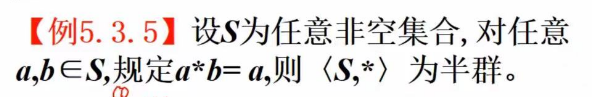
        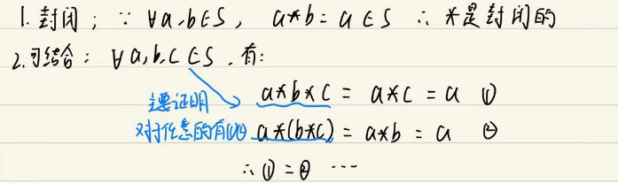
    2. 证明不是半群：1.不封闭 2. 不可结合
        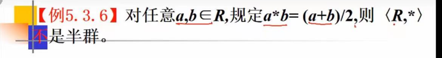
        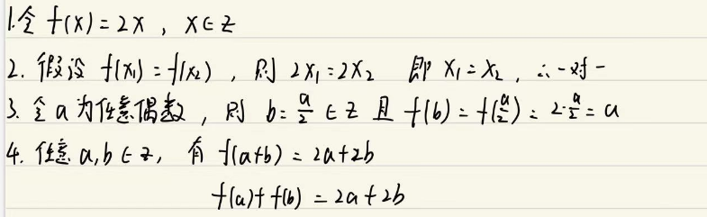
4. 一个有限的集合一定有一个等幂元

   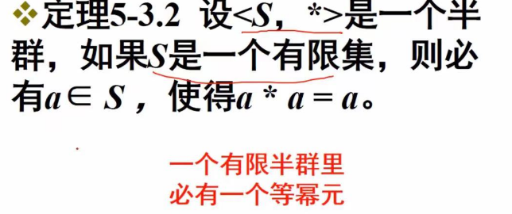

---

定义：

1. indentity 单位元、幺元：任意a∈S,e\*a = a\*e = a ，则称e是半群(S,\*)的幺元
2. Monoid 独异点、含幺半群：半群(S,\*)含有一个幺元，则称其为monoid
3. Subsemigroup 子半群：半群(S,\*) ,B$\subseteq$S且\*在B上是封闭的，则称(B,\*)是(S,\*)的子半群
4. Submonoid 子独异点:如果e∈S且e∈B，(B,\*)是(S,\*)的子半群,则称(B,\*)是(S,\*)的子独异点

例：

---

定义：

1. isomorphism 同构映射：(S,\*) 与 (T,\*')是半群。函数 f :S->T 被称作从(S,\*)到(T,\*')的一个isomorphism，（f的逆也是同构映射）如果满足：

   1. f：S->T ,是 （one-to-one 一对一） (onto)
   2. f(a\*b) = f(a)\*'f(b)

2. Isomorphic semigroups 同构半群：如果f是一个isomorphism从(S,\*) 到 (T,\*')，则称(S,\*) 与 (T,\*')是同构半群，记为S≌T
3. 理论：(S,\*) 与 (T,\*')是独异点且幺元分别为：e,e',f是isomorphism，则有：

   * f(e) = e'

4. 同构描述了两个集合和运算之间的对应关系

证明是同构半群：

1. 定义一个 f :S->T。(这里f是自己定义的，但是要符合要求)
2. 证明f是one-to-one，一对一，单射。即证明：当y相等时,x也一定相等。一个y只对应一个x
3. 证明f是onto，满射。即证明：对于任意一个y，都有对应的x
4. 证明 f(a\*b) = f(a)\*'f(b)

例：

1. 1
   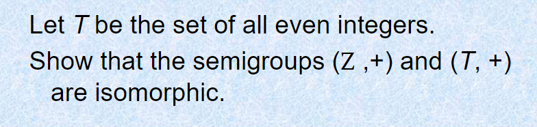
2. 2
   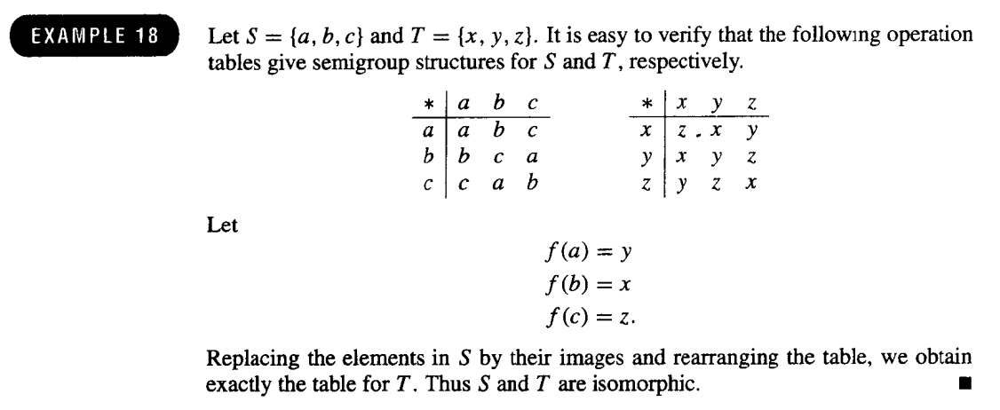
   注：人为规定f(x)=y(其中x∈S,y∈T)，此时已经满足one-to-one,onto,只需要证明：f(a\*b) = f(a)\*'f(b)

---

定义：

1. Homomorphism 同态：如果：任意a,b∈S,有f(a\*b) = f(a)\*'f(b),则称 f :S->T 是作从(S,\*)到(T,\*')的一个Homomorphism,

2. 称f(A) 为同态象， 其中 f(A) = { f(x) | x∈A }

3. 当同态映射分别是单射，满射，双射时，分别称f时单同态，满同态，同构

定理：

1. (S,\*),(T,\*')为独异点，对应的单位元为e,e'，且f:S->T为同态映射且为满射，则f(e) =e';

2. 子半群通过同态映射后仍是对应集合的子半群

3. 如果f是从可交换的半群(S,\*)到半群(T,\*')的一个满射的同态映射，则(T,\*')也是可交换的;

---

## products and quotients of semigroups 乘积半群和商半群

theorem:

1. 如果(S,\*)和(T,\*')是半群，则(S×T, \*'')也是半群，其中\*''被定义为：(s1,t1) \*'' (s2,t2) = (s1\*s2,t1\*'t2)。

2. 如果S，T是独异点，e$_S$,e$_T$ ,则S×T也是独异点(e$_S$,e$_T$)

3. confruence relation 同余关系

   * 一个定义在半群(S,\*)上的**等价关系**R被称为同余关系，如果aRa'且bRb' -> (a\*b)R(a'\*b')

   证明：

   1. R为等价关系
   2. (S,\*)为半群
   3. 满足aRa'且bRb' -> (a\*b)R(a'\*b')

4. quotuent semigroup 商半群

   * R是半群(S,\*)的一个同余关系，⊙是从S/R × S/R 到 S/R 的关系，且有⊙([a],[b]) = [a]⊙[b] = [a*b], 则称 (S/R,⊙)为商半群

5. the nutural homomorphism 自然同态

   * 令R是半群(S,\*)的同余关系，(S/R,⊙)是对应的商半群
   * 则函数： f$_R$ : S->S/R (f$_R$(a) = [a] ),是一个满同态（不用S中的所有元素都有S/R的对应，被称为自然同态

6. (重要) Fundamental Homomorphism Theorem 同态基本定理

   * f: S->T 是一个从(S,\*)**满射**(T,\*')的同态映射；
   * R是定义在S上的关系，且aRb 当且仅当 f(a)=f(b)
   * 则有 R是同余关系，(T,*')和商半群(S/R,g)是同构映射

---

## groups and subgroups 群和子群

定义：

1. < G,\* >是一个代数系统，其中G是非空集合，\*是G上的一个二元运算，< G,\* >是一个群，如果：

   * 运算\*是封闭的
   * 运算\*是可结合的
   * 存在幺元e
   * 对于每一个元素x∈G,存在它的逆元x$^{-1}$。x*x$^{-1}=e
   * 以上也是证明群的证明的步骤
  
2. Abelian 阿贝尔群

   如果 ab = ba 对于所有a,b in G 成立 ,则称G为阿尔贝群（可交换的）  
   (ab)$^{-1}$ = b$^{-1}$a$^{-1}$.  
   证明：b$^{-1}$a$^{-1}$ab = e;abb$^{-1}$a$^{-1}$ =e ,所以(ab)$^{-1}$ = b$^{-1}$a$^{-1}$

3. theorem:

   1. G是一个群，任意元素a in G ,a在G中仅存在唯一逆元
   2. ab = ac -> b=c;   ba = ca -> b = c
   3. a的逆的逆 = a ； (ab)$^{-1}$ = b$^{-1}$a$^{-1}$
   4. ax = b有唯一解； ya = b 有唯一解

4. 有限群：G含有有限个数元素。 **order（阶）** |G|中元素的个数

   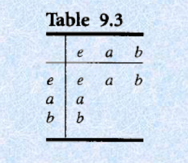  
   三阶

5. subgroup 子群

   H是G的一个子群如果：

   * G的幺元也在H中
   * a和b∈H, 则 ab属于H
   * a属于H， 则a$^{-1}$∈H

   G和H={e} 是G的平凡子群(trivial subgroups)

6. homomorphism

   (G,*) 和 (G',\*')是两个群，f:G -> G'是G到G'的同态映射，则有：

   * e是G的幺元，e'是G'的幺元。则：f(e)=e'
   * a∈G,则f(a$^{-1}$) = (f(a))$^{-1}$
   * H 是 G 的一个子群，则f(H) = {f(h)|h∈H} 是G'的子群。H是G的子群，则H中的元素映射结果一定属于G' ，因为G也是这样的

7. Klein 4 group

   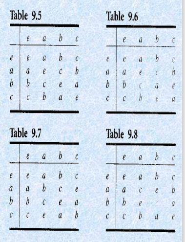

## Products and Quotients of Groups

1. 如果(S,\*)和(T,\*')是群，则(S×T, \*'')也是群，其中\*''被定义为：(s1,t1) \*'' (s2,t2) = (s1*s2,t1*'t2)。

2. R是群(S,\*)的一个同余关系，f是从S/R × S/R 到 S/R 的关系，且有f([a],[b]) = [a]f[b] = [a*b], 则称 (S/R,f)为商群

3. 定义：

   H 是G 的一个子群 ，a∈G

   1. left coset(左陪集) aH = {ah|h∈H}
   2. right coset(右陪集) Ha = {ha|h∈H}
   3. H是G的正规子群 ， if aH = Ha（集合相等）
   4. 注意集合相等证明是相互包含。
   5. ah 可能不等于 ha。这里只要集合相等就行
   6. if a∈A, aA = A
4. 推论

   令N是G的子群，任意a∈G, 定义 a$^{-1}$Na = { a$^{-1}$na | n∈N }
   则：N是G的正规子群  iff   a$^{-1}$Na = N , 任意a∈G

5. 理论

   N是G的一个正规子群，R定义在G上且：aRb 当且仅当 a$^{-1}$b ∈ N
   则：

   * R 是定义在G上的同余关系
   * N = [e] 其中 e是G的幺元

6. 推论

   令 f 是从(G,*) 到 (G',*') 的满同态映射  
   f 的**核(kernel)**，ker(f)， 定义为： ker(f) = {a∈G| f(a)=e'}

   有：ker(f) 是G的一个正规子群
   商群 G/ker(f) 到 G' 是同构

7. 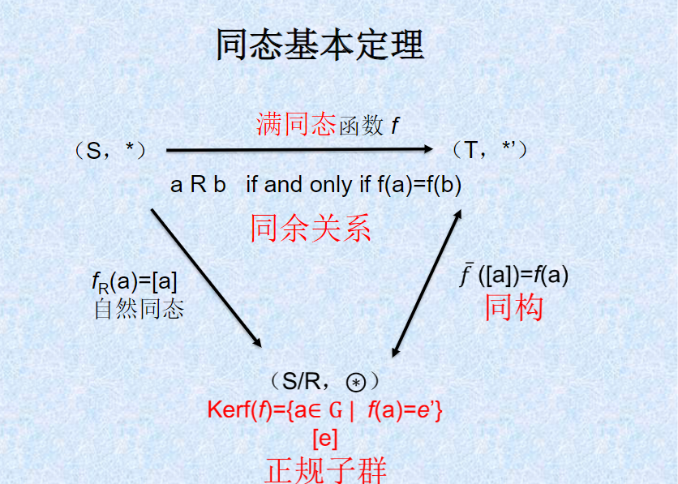
